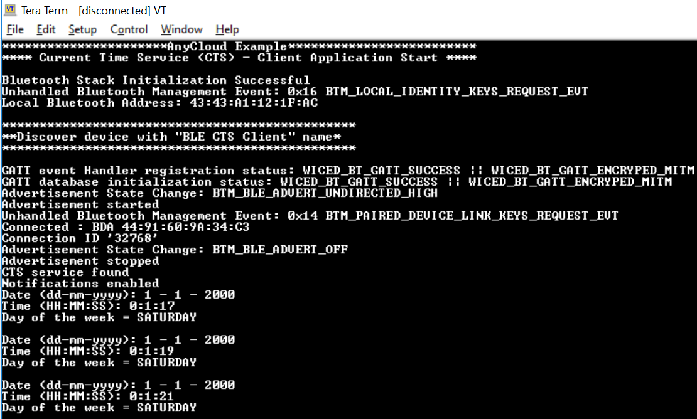

# BLE_Client

This code example demonstrates the implementation of a simple BLE GAP Peripheral - GATT Client with Custom Service receiving custom data from Client ([BLE_Client](https://github.com/kpriyaGit/Project_SoSe2021_TeamSecurity/tree/feature/project_implementation/BLE_Client)) using the Cypress Combo (Wi-Fi+BT) SoCs and ModusToolbox™ Software Environment.

In this code example, the kit advertises as 'BLE CTS Client' and after connection with a Custom Service based server, enables notifications for 'custom_service' characteristic. The customised data received through the notification are printed on the serial terminal.

Use this code with [BLE Server](https://github.com/kpriyaGit/Project_SoSe2021_TeamSecurity/tree/feature/project_implementation/BLE_Server).

## Requirements

- [ModusToolbox™ software](https://www.cypress.com/products/modustoolbox-software-environment) v2.3 + v2.3.1 (patch)
- Programming Language: C
- Associated Parts: [PSoC® 6 MCU](http://www.cypress.com/PSoC6), [CYW43012](https://www.cypress.com/documentation/product-overviews/cypress-cyw43012), [CYW4343W](https://www.cypress.com/documentation/datasheets/cyw4343w-single-chip-80211-bgn-macbasebandradio-bluetooth-41)

## Hardware Setup

- [CY8CKIT-064S0S2-4343W](https://www.infineon.com/cms/en/product/evaluation-boards/cy8ckit-064s0s2-4343w/?utm_source=cypress&utm_medium=referral&utm_campaign=202110_globe_en_all_integration-dev_kit)

## Software Setup

Install a terminal emulator if you don't have one. Instructions in this document use [Tera Term](https://ttssh2.osdn.jp/index.html.en).

## Using the Code Example

Clone the repository for BLE Client from gitlab and perform the following steps

### In Eclipse IDE for ModusToolbox:

1. Click the **New Application** link in the Quick Panel (or, use **File** > **New** > **ModusToolbox Application**).

2. Pick CY8CKIT-064B0S2-4343W from the list shown in the **Project Creator - Choose Board Support Package (BSP)** dialog.

   When you select a supported kit, the example is reconfigured automatically to work with the kit. You can use the Library Manager to select or update the BSP and firmware libraries used in this application.

   To access the Library Manager, right-click the application name from the Project Workspace window in the IDE, and select **ModusToolbox** > **Library Manager** (or select it from the **Quick Panel**).

3. In the **Project Creator - Select Application** dialog, Import the project by providing the local path of the cloned repository.

4. Optionally, update the **Application Name** and **Location** fields with the application name and local path where the application is created.

5. Click **Create** to complete the application creation process.

For more details, see the Eclipse IDE for ModusToolbox User Guide: *{ModusToolbox install directory}/ide_{version}/docs/mt_ide_user_guide.pdf*.


## Operation
1. Connect the board to your PC using the provided USB cable through the KitProg3 USB connector.

2. Use your favorite serial terminal application and connect to the KitProg3 COM port. Configure the terminal application to access the serial port using the following settings.

   Baud rate: 115200 bps; Data: 8 bits; Parity: None; Stop: 1 bit; Flow control: None; New line for receive data: Line Feed(LF) or Auto setting

3. Program the board.

   - **Using Eclipse IDE for ModusToolbox**:

      1. Select the application project in the Project Explorer.

      2. In the **Quick Panel**, scroll down, and click **\<Application Name> Program (KitProg3)**.


   - **Using CLI (Not tested in local)**:

      From the terminal, execute the `make program` command to build and program the application using the default toolchain to the default target. You can specify a target and toolchain manually:

      ```
      make program TARGET=<BSP> TOOLCHAIN=<toolchain>
      ```

      Example:

      ```
      make program TARGET=CY8CKIT-062S2-43012 TOOLCHAIN=GCC_ARM
      ```

        **Note**:  Before building the application, ensure that the *deps* folder contains the BSP file (*TARGET_xxx.lib*) corresponding to the TARGET. Execute the `make getlibs` command to fetch the BSP contents before building the application.

   After programming, the application starts automatically. Observe the messages on the UART terminal, and wait for the device to make all the required connections.

4. Use another supported PSoC 6 kit and program it with the [BLE Server](https://github.com/kpriyaGit/Project_SoSe2021_TeamSecurity/tree/feature/project_implementation/BLE_Server) code example.

5. Once both the kits are powered, press the user button on Server to start scanning for peripheral devices and press user button on the client to start advertising. Once connection is established, the client device will subscribe for notifications, decrypt and print the received customised data on the serial terminal.

   **Figure 1. Terminal Output**
   

## Debugging

You can debug the example to step through the code. In the IDE, use the **\<Application Name> Debug (KitProg3)** configuration in the **Quick Panel**. For more details, see the "Program and Debug" section in the Eclipse IDE for ModusToolbox User Guide: *{ModusToolbox install directory}/ide_{version}/docs/mt_ide_user_guide.pdf*.

## Design and Implementation

The code example configures the device as a BLE GAP Peripheral and GATT Client. Custom service characteristic is showcased in the example. The device advertises with the name 'BLE CTS Client'. After connection with the BLE Central device, it sends a Service Discovery (by UUID) request. If CTS UUID is present in the Server GATT database, the client device enables notifications for Custom Service by writing into the Client Characteristic Configuration Descriptor (CCCD). The custom data notifications received are decrypted and printed on the terminal.

The project uses an LED present on the kit to indicate the advertisement and connection status.

- LED OFF: The kit is not advertising and is not connected to any peer device.
- LED Blinking: The kit is advertising but not connected to any peer device.
- LED ON: The kit has stopped advertising and is connected to a peer device.

The application uses a UART resource from the Hardware Abstraction Layer (HAL) to print debug messages on a UART terminal emulator. The UART resource initialization and retargeting of standard I/O to the UART port are done using the retarget-io library.

## Resources and Settings
This section explains the ModusToolbox resources and their configuration as used in this code example. Note that all the configuration explained in this section has already been done in the code example. ModusToolbox stores the configuration settings of the application in the *design.modus* file. This file is used by the graphical configurators, which generate the configuration firmware. This firmware is stored in the application’s *GeneratedSource* folder.

- **Device Configurator:** Use this tool to enable/configure the peripherals and pins used in the application. See the
[Device Configurator Guide](https://www.cypress.com/ModusToolboxDeviceConfig).

- **Bluetooth Configurator:** Use this tool to generate/modify the BLE GATT database. See the
[Bluetooth Configurator Guide](https://www.cypress.com/ModusToolboxBLEConfig).


## Document History

Document Title: *BLE_Client*

| Version | Description of Change                |
| ------- | -------------------------------------|
| 1.0.0   | New code example                     |
| 1.0.1   | Modified for Security_SS2021 project |

------
