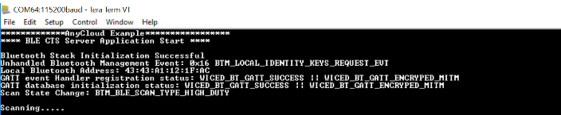
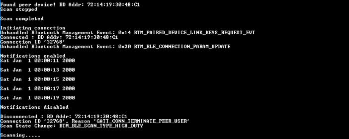

# BLE_Server

This code example demonstrates the implementation of a simple BLE GAP Central - GATT Server with Custom Service transmitting custom data from Server ([BLE_Server](https://github.com/kpriyaGit/Project_SoSe2021_TeamSecurity/tree/feature/project_implementation/BLE_Server)) using the Cypress Combo (Wi-Fi+BT) SoCs and ModusToolbox™ Software Environment.

In this code example, the kit scans for "BLE CTS Client", and after connection with a Custom Service based client, sends notifications with Custom values derived from the Bluetooth configurator tool. This data is encrypted with AES Encryption and transmitted to the Client.

Use this code with [BLE Client](https://github.com/kpriyaGit/Project_SoSe2021_TeamSecurity/tree/feature/project_implementation/BLE_Client).

## Requirements

- [ModusToolbox™ software](https://www.cypress.com/products/modustoolbox-software-environment) v2.3 + v2.3.1 (patch)
- Programming Language: C
- Associated Parts: [PSoC® 6 MCU](http://www.cypress.com/PSoC6), [CYW43012](https://www.cypress.com/documentation/product-overviews/cypress-cyw43012), [CYW4343W](https://www.cypress.com/documentation/datasheets/cyw4343w-single-chip-80211-bgn-macbasebandradio-bluetooth-41)

## Hardware Setup

- [CY8CKIT-064S0S2-4343W](https://www.infineon.com/cms/en/product/evaluation-boards/cy8ckit-064s0s2-4343w/?utm_source=cypress&utm_medium=referral&utm_campaign=202110_globe_en_all_integration-dev_kit)

## Software Setup

Install a terminal emulator if you don't have one. Instructions in this document use [Tera Term](https://ttssh2.osdn.jp/index.html.en).

## Using the Code Example

Clone the repository for BLE Server from gitlab and perform the following steps

### In Eclipse IDE for ModusToolbox:

1. Click the **New Application** link in the Quick Panel (or, use **File** > **New** > **ModusToolbox Application**).

2. Pick CY8CKIT-064B0S2-4343W from the list shown in the **Project Creator - Choose Board Support Package (BSP)** dialog.

   When you select the supported kit, the example is reconfigured automatically to work with the kit. You can use the Library Manager to select or update the BSP and firmware libraries used in this application.

   To access the Library Manager, right-click the application name from the Project Workspace window in the IDE, and select **ModusToolbox** > **Library Manager** (or select it from the **Quick Panel**).

3. In the **Project Creator - Select Application** dialog, Import the project by providing the local path of the cloned repository.

4. Optionally, update the **Application Name** and **Location** fields with the application name and local path where the application is created.

5. Click **Create** to complete the application creation process.

   For additional details, see the Eclipse IDE for ModusToolbox User Guide: *{ModusToolbox install directory}/ide_{version}/docs/mt_ide_user_guide.pdf*.


## Operation
1. Connect the board to your PC using the provided USB cable through the KitProg3 USB connector.

2. Use your favorite serial terminal application and connect to the KitProg3 COM port. Configure the terminal application to access the serial port using the following settings.

   Baud rate: 115200 bps; Data: 8 bits; Parity: None; Stop: 1 bit; Flow control: None; New line for receive data: Line Feed(LF) or Auto setting

3. Program the board.

   - **Using Eclipse IDE for ModusToolbox**:

      1. Select the application project in the Project Explorer.

      2. In the **Quick Panel**, scroll down, and click **\<Application Name> Program (KitProg3)**.


   - **Using CLI (Not tested in local)**:

      From the terminal, execute the `make program` command to build and program the application using the default toolchain to the default target. You can specify a target and toolchain manually:

      ```
      make program TARGET=<BSP> TOOLCHAIN=<toolchain>
      ```

      Example:

      ```
      make program TARGET=CY8CKIT-062S2-43012 TOOLCHAIN=GCC_ARM
      ```
      
        **Note**:  Before building the application, ensure that the *deps* folder contains the BSP file (*TARGET_xxx.lib*) corresponding to the TARGET. Execute the `make getlibs` command to fetch the BSP contents before building the application.

   After programming, the application starts automatically. Observe the messages on the UART terminal, and wait for the device to make all the required connections.

    **Figure 1. Terminal Bootup Output**
 
    

4. Use another supported PSoC 6 kit and program it with the[BLE_Client](https://github.com/kpriyaGit/Project_SoSe2021_TeamSecurity/tree/feature/project_implementation/BLE_Client) code example.

5. Once both the kits are powered, press the user button on Server to start scanning for peripheral devices and press user button on the client to start advertising. The server device will start sending the notification with Custom characteristic values derived from the bluetooth configurator after connection is established. The encrypted values sent as notification will be printed on the serial terminal.

   **Figure 2. Terminal Output - Sending Notification**
   

## Debugging

You can debug the example to step through the code. In the IDE, use the **\<Application Name> Debug (KitProg3)** configuration in the **Quick Panel**. For more details, see the "Program and Debug" section in the Eclipse IDE for ModusToolbox User Guide: *{ModusToolbox install directory}/ide_{version}/docs/mt_ide_user_guide.pdf*.

## Design and Implementation
The [BLE Server](https://github.com/kpriyaGit/Project_SoSe2021_TeamSecurity/tree/feature/project_implementation/BLE_Server) configures the device as a BLE GAP Central - GATT Server device. Use this application with the [BLE Client](https://github.com/kpriyaGit/Project_SoSe2021_TeamSecurity/tree/feature/project_implementation/BLE_Client), which is a GAP Peripheral - GATT Client device.

The reference base projects are:
[AnyCloud BLE CTS Server](https://github.com/Infineon/mtb-example-anycloud-ble-cts-server/tree/release-v1.0.0)
[AnyCloud BLE CTS Client](https://github.com/Infineon/mtb-example-anycloud-ble-cts-client/tree/release-v1.0.0)
Thi above code examples showcase the Current Time Service-based Time profile. In this, the mandatory Current Time Characteristic with Read and Notify properties are implemented. The Time profile defines two roles: Time Server (GATT Server) and Time Client (GATT Client).  


The entry point of the application is `int main()`, which initializes the Board Support Package (BSP) and BT stack. The application level initializations, for example RTC, timer, GATT database initialization, are handled by the `ble_app_init()` function. This function starts scanning for the peripheral device by registering a callback using `wiced_bt_ble_scan()`. 

This application will specifically scan for advertisement with the Peripheral device name `BLE CTS Client` and establish a LE GATT connection. All the GATT events are handled in `ble_app_gatt_event_handler()`. During Read or Notify GATT operations, the fields of Custom Service characteristics are derived from the `cycfg_gatt_db.c` file generated based on the configurations made in the Bluetooth configurator. This data is encrypted using AES in `encrypt_message()`. The encrypted message is printed on the serial terminal and sent as GATT read response or as Notification to the Peripheral device

The application uses a UART resource from the Hardware Abstraction Layer (HAL) to print debug messages on a UART terminal emulator. The UART resource initialization and retargeting of the standard I/O to the UART port is done using the retarget-io library.

**Table 1. Important User-Application-Related Source Files**

|**File Name**|**Comments**|
|-----------------------------------|-------------------------------------------------------|
|*main.c* | Contains the `int main()` function, which is the entry point for execution of the user application code after device startup.|
|*app_bt_cfg.c, app_bt_cfg.h* |	Contain the runtime Bluetooth stack configuration parameters such as device name and  advertisement / connection settings.|
|*app_bt_utils.c, app_bt_utils.h* |Contains the utility functions that will help debugging and developing the applications easier with much more meaningful information.|
|*cycfg_gatt_db.c, cycfg_gatt_db.h*|Files in the *GeneratedSource* folder under the application folder. They contain the GATT database information generated using the Bluetooth Configurator tool.|

## Resources and Settings
This section explains the ModusToolbox resources and their configuration as used in this code example. Note that all the configuration explained in this section has already been done in the code example. ModusToolbox stores the configuration settings of the application in the *design.modus* file. This file is used by the graphical configurators, which generate the configuration firmware. This firmware is stored in the application’s *GeneratedSource* folder.

- **Device Configurator:** Use this tool to enable/configure the peripherals and pins used in the application. See the
[Device Configurator Guide](https://www.cypress.com/ModusToolboxDeviceConfig).

- **Bluetooth Configurator:** Use this tool to generate/modify the BLE GATT database. See the
[Bluetooth Configurator Guide](https://www.cypress.com/ModusToolboxBLEConfig).


## Document History

Document Title: *BLE_Server*

| Version | Description of Change                |
| ------- | -------------------------------------|
| 1.0.0   | New code example                     |
| 1.0.1   | Modified for Security_SS2021 project |

------
